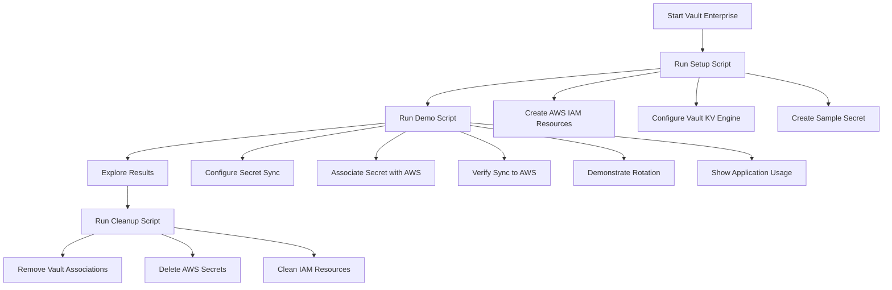

# Demo Overview

This directory contains a modernized HashiCorp Vault Enterprise Secret Sync demonstration, updated from the original Jupyter notebook format to a more accessible and professional implementation using bash scripts and markdown documentation.

## File Structure

### Core Demo Files

| File | Purpose |
|------|---------|
| `README.md` | Comprehensive guide with step-by-step instructions |
| `QUICK_START.md` | 5-minute quick start guide for experienced users |
| `vault.sh` | Starts Vault Enterprise in Docker (provided) |
| `01-setup.sh` | Automated setup script for AWS IAM and Vault configuration |
| `02-demo.sh` | Interactive demo script showcasing Secret Sync functionality |
| `03-cleanup.sh` | Complete cleanup script for all demo resources |

### Supporting Files

| File | Purpose |
|------|---------|
| `aws-policy.json` | IAM policy definition for Vault Secret Sync |
| `TROUBLESHOOTING.md` | Comprehensive troubleshooting guide |
| `DEMO_OVERVIEW.md` | This file - explains the demo structure |
| `.gitignore` | Prevents sensitive files from being committed |

### Legacy Files

| File | Purpose |
|------|---------|
| `outdated-demo.ipynb` | Original Jupyter notebook demo (archived) |
| `vault.hclic` | Vault Enterprise license file (required) |

## Demo Flow



## Key Improvements from Original Demo

### 1. **Accessibility**
- **Before**: Required Jupyter environment, Python knowledge
- **After**: Simple bash scripts, no Python required

### 2. **Professional Presentation**
- **Before**: Code cells mixed with explanatory text
- **After**: Clear separation between documentation and executable scripts

### 3. **Error Handling**
- **Before**: Manual error checking
- **After**: Comprehensive error handling and validation

### 4. **User Experience**
- **Before**: Step-by-step manual execution
- **After**: Automated setup with interactive demo

### 5. **Documentation**
- **Before**: Embedded in notebook
- **After**: Comprehensive markdown documentation with troubleshooting

### 6. **Reproducibility**
- **Before**: Dependent on HashiCorp internal tools (doormat)
- **After**: Works for any user with AWS credentials

## Technical Architecture

The demo showcases this architecture:

```
┌─────────────────┐    Secret Sync    ┌──────────────────────┐
│  HashiCorp      │ ───────────────── │   AWS Secrets        │
│  Vault          │                   │   Manager            │
│  (KV v2 Store)  │                   │                      │
└─────────────────┘                   └──────────────────────┘
         │                                        │
         │ Direct API                             │ Native SDK
         │ (Admin/Ops)                            │ (Applications)
         ▼                                        ▼
┌─────────────────┐                   ┌──────────────────────┐
│   Vault CLI     │                   │    Your AWS          │
│   Web UI        │                   │    Applications      │
└─────────────────┘                   └──────────────────────┘
```

## Educational Value

This demo teaches:

1. **Centralized Secret Management**: How Vault serves as the single source of truth
2. **Zero-Trust Architecture**: Applications access secrets through cloud-native APIs
3. **Operational Efficiency**: Automated synchronization eliminates manual processes
4. **Developer Experience**: No application code changes required
5. **Security Benefits**: Comprehensive audit trails and consistent policies

## Target Audience

- **DevOps Engineers**: Learn secret management best practices
- **Platform Engineers**: Understand multi-cloud secret synchronization
- **Security Teams**: See centralized audit and policy enforcement
- **Developers**: Experience seamless secret access patterns
- **Solution Architects**: Evaluate Vault Enterprise capabilities

## Demo Variations

The scripts support several demo modes:

### Quick Demo (5 minutes)
```bash
export DEMO_PAUSE=0  # Skip interactive pauses
./01-setup.sh && ./02-demo.sh && ./03-cleanup.sh
```

### Interactive Demo (15-20 minutes)
```bash
# Default mode with explanations and pauses
./01-setup.sh
./02-demo.sh
./03-cleanup.sh
```

### Manual Exploration
Follow the step-by-step instructions in `README.md` for deep understanding.

## Production Considerations

This demo uses simplified configurations for educational purposes. For production:

- Use IAM roles instead of access keys
- Implement least-privilege policies
- Enable comprehensive audit logging
- Use proper Vault authentication methods
- Deploy Vault in high-availability mode
- Implement proper TLS/encryption

## Next Steps

After completing this demo, users typically explore:

1. **Multi-cloud sync** with Azure Key Vault and GCP Secret Manager
2. **Dynamic secrets** for database credentials
3. **Vault Agent** for application integration
4. **Enterprise features** like namespaces and replication

## Feedback and Contributions

This demo is designed to be:
- **Accessible** to users with minimal secret management experience
- **Professional** following HashiCorp style guidelines
- **Comprehensive** covering the complete Secret Sync workflow
- **Reliable** with extensive error handling and troubleshooting

The modular design allows for easy customization and extension for specific use cases or environments. 